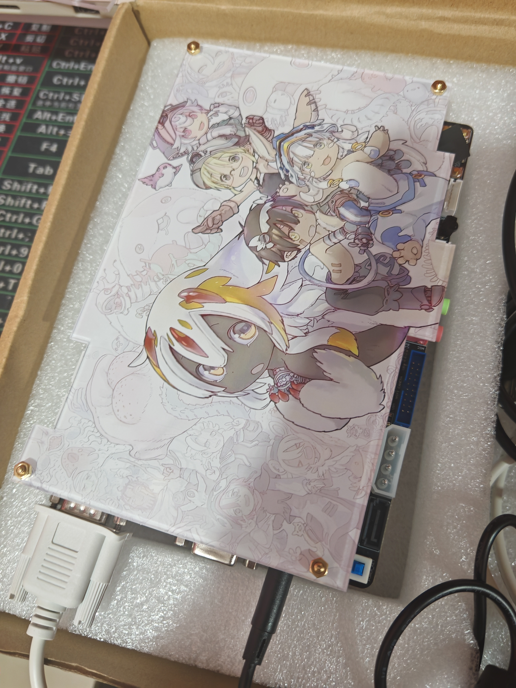

# RK3568 Acrylic Case & Design Resources

> 为讯为 (topeet) RK3568 开发板设计的定制化亚克力保护外壳及配套设计资源。

## 📖 项目简介 (About)

本项目旨在为 **讯为 RK3568 开发板** 提供一款美观且实用的亚克力材质外壳解决方案。

主要功能：
- 🛡️ **物理防护**：有效防止灰尘进入及意外短路。
- 🎨 **个性化外观**：采用双层亚克力设计，结合精美插画，提升桌面颜值。
- 🔩 **易于组装**：使用标准铜柱固定，安装拆卸便捷。

## 📂 文件说明 (File Structure)

本仓库包含了从设计源文件到成品预览的完整资源：

| 文件名 | 类型 | 说明 |
| :--- | :--- | :--- |
| `Panel_Panel1_2026-09-16.epanm` | EPLAN/嘉立创工程文件 | 亚克力切割与丝印的工程源文件，可用于直接生产。 |
| `PNG_Panel1_2026-09-16.png` | PNG亚克力板文件 | 所为参考使用 |
| `illustration.psd` | Photoshop 源文件 | 外壳图案的设计原稿，包含图层信息，方便二次修改。 |
| `IMG_20260912_195000.jpg` | JPG 图片 | **成品实拍图**，展示组装后的实际效果（见下图）。 |
| `主角.png` / `背景.png` | PNG 图片 | 设计用的素材分层图（透明背景）。 |
| `原图.webp` | WebP 图片 | 插画原始素材。 |

## 📸 成品展示 (Showcase)

## 🛠️ 制作与组装 (Fabrication)

如果你也想制作同款外壳：
1. **下载源文件**：获取 `.epanm` 或 `.psd` 文件。
2. **生产切割**：将工程文件导入激光切割机或发送给亚克力加工服务商（如嘉立创等）。
3. **组装**：准备 M3 规格的铜柱和螺丝，按照开发板孔位进行固定。

## ⚠️ 注意事项

- 请在切割前仔细核对开孔尺寸（本项目留有4mm直径的过孔），确保与你的开发板版本（RK3568）一致。
- 撕掉亚克力保护膜后效果更佳。
- 没有为散热风扇预留开口，请自行裁剪设计

## 📄 License

本项目遵循 **MIT License** 开源协议。你可以自由使用、修改和分发本设计，但请保留原作者署名。

---
Made with ❤️ by kjs787
如有侵权，请联系我删除
